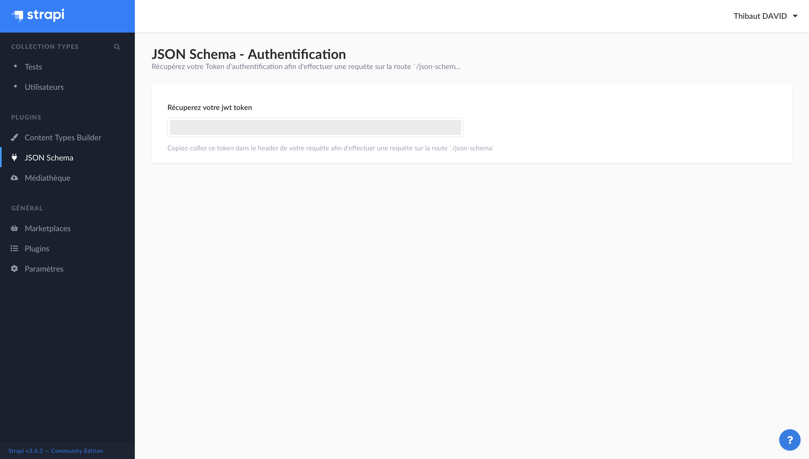

# Strapi - JSON Schema plugin

[![npm version][npm-version-src]][npm-version-href]
[![npm downloads][npm-downloads-src]][npm-downloads-href]
[![License][license-src]][license-href]

> Generate [JSON Schema](https://json-schema.org) based on your Strapi content types.

- [✨ &nbsp;Release Notes](https://github.com/stun3r/strapi-plugin-json-schema/releases)

## How it works?

1. Generate JSON schema based on your Strapi content types.
2. Add custom keyword `kind` in order to tell you if it's a single type or a collection type.
3. The Strapi SDK will trigger this plugin in order to generate Typescript Types.

## Getting started

### ⏳ Installation

You have to install this plugin within your Strapi project thanks [**yarn**](https://classic.yarnpkg.com/en/docs/install/):
```bash
yarn add strapi-plugin-json-schema
```

After successful installation you've to build a fresh package that includes plugin UI. To archive that simply use:

```bash
yarn build --clean
yarn develop
```

or just run Strapi in the development mode with `--watch-admin` option:

```bash
yarn develop --watch-admin
```

The **JSON Schema** plugin should appear in the **Plugins** section of Strapi sidebar after you run app again.

Enjoy 🎉

### 🖐 Requirements

Complete installation requirements are exact same as for Strapi itself and can be found in the documentation under <a href="https://strapi.io/documentation/v3.x/installation/cli.html#step-1-make-sure-requirements-are-met">Installation Requirements</a>.

**Supported Strapi versions**:

- Strapi v3.6.0 (recently tested)
- Strapi v3.x

(This plugin may work with the older Strapi versions, but these are not tested nor officially supported at this time.)

**We recommend always using the latest version of Strapi to start your new projects**.

### 🕹 Usage

In order to use it, you can use your best HTTP Client or software like Postman.

Then you'll have to go to your [admin panel](http://localhost:1337/admin/plugins/json-schema) in order to copy your JWT token & paste into `Authorization` header.
Finally you'll be able to trigger the endpoint `strapi-host/json-schema` and it will return an array of JSON Schema.

## License

[MIT License](./LICENSE)

<!-- Badges -->
[npm-version-src]: https://img.shields.io/npm/v/strapi-plugin-json-schema/latest.svg?style=flat-square
[npm-version-href]: https://npmjs.com/package/strapi-plugin-json-schema

[npm-downloads-src]: https://img.shields.io/npm/dt/strapi-plugin-json-schema.svg?style=flat-square
[npm-downloads-href]: https://npmjs.com/package/strapi-plugin-json-schema

[license-src]: https://img.shields.io/npm/l/strapi-plugin-json-schema.svg?style=flat-square
[license-href]: ./LICENSE